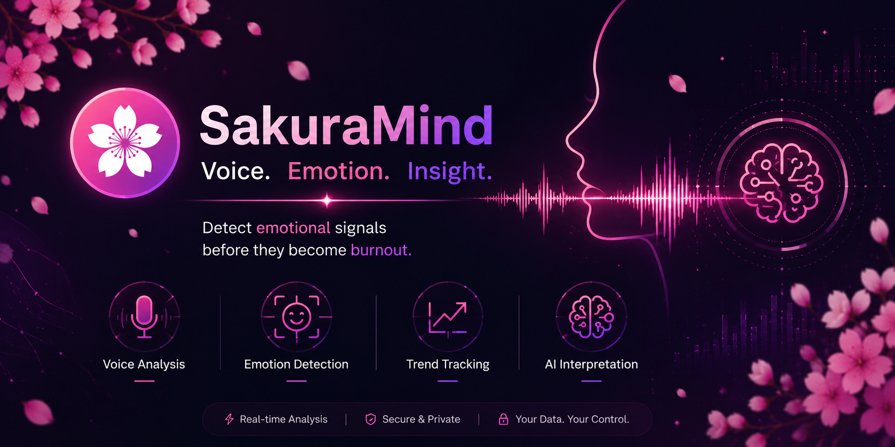

<p align="center">
  
</p>

## 🌸 AI-Powered Emotional Wellness Platform

SakuraMind is an AI-powered emotional wellness platform that transforms voice recordings into meaningful emotional insights.

By combining audio signal processing, machine learning, and behavioral analytics, SakuraMind helps users better understand emotional patterns through voice-based analysis, trend tracking, and personalized reporting.

Built at the intersection of Artificial Intelligence, Wellness Technology, and User-Centered Design.

## Table of Contents

1. Project Overview
2. Core Capabilities
3. Architecture
4. Repository Structure
5. Technology Stack
6. Quick Start
7. Detailed Setup
8. API Reference
9. Authentication Model
10. Model Training Pipeline
11. Development Scripts
12. Known Limitations
13. Troubleshooting
14. Roadmap

## Project Overview

SakuraMind is an AI-powered emotional wellness platform that explores how voice signals can be used to better understand emotional patterns and behavioral trends.

The system captures short voice recordings, converts them into mel spectrograms, performs machine learning inference, and generates emotional insights that can be tracked over time.

### Key Goal

The primary objective of SakuraMind is to investigate whether voice-based emotional analysis can provide an accessible and intuitive way for users to monitor emotional well-being before patterns develop into long-term burnout or emotional fatigue.

The current implementation is optimized for local/demo use and rapid iteration.

## Core Capabilities

### 🎤 Voice Analysis
- Real-time voice recording in the browser
- Minimum-length recording validation
- Automatic audio preprocessing

### 🧠 Emotion Detection
- Mel spectrogram generation
- ResNet18-based emotion classification
- Confidence score estimation

### 📊 Emotional Insights
- Emotion trend tracking
- Historical session analysis
- Emotional balance monitoring

### 📁 Report Management
- Session report browser
- Report locking and unlocking
- Local report persistence

### ⚙️ Personalization
- Theme customization
- Brightness controls
- Remember Me session persistence

## Architecture

```text
User Voice
    │
    ▼
Next.js Frontend
    │
    ▼
Audio Processing (FFmpeg)
    │
    ▼
Python Inference Engine
    │
    ▼
ResNet18 Emotion Model
    │
    ▼
Emotion Analysis
    │
    ▼
Reports & Dashboard
```

SakuraMind uses a hybrid flow:

1. User records audio in the frontend.
2. Frontend posts audio blob to Next.js API route.
3. API route converts WebM to WAV with ffmpeg.
4. API route invokes Python inference script.
5. Python script loads model, predicts emotion, writes artifacts:
   - mel.png
   - history.txt
6. API returns normalized emotion + confidence to frontend.
7. Frontend stores enriched report metadata in browser storage.

High-level data path:

Frontend (Next.js) -> /api/analyze -> Python (backend/inference.py) -> Model (Model/emotion_model.pth)

## Repository Structure

```text
SakuraMind/
  backend/
    inference.py
    main.py
    demo_update.py
  frontend/
    app/
      (app)/
        dashboard/
        voice/
        reports/
        settings/
      api/
        analyze/
        sentiment/
        mel/
      login/
      signup/
      page.tsx
    components/
    hooks/
    lib/
    package.json
  Model/
    emotion_model.pth
    scripts/
      organize_dataset.py
      convert_spectrograms.py
      train.py
      fix_cremad.py
    dataset/
    spectrograms/
  history.txt
  mel.png
  README.md
```

## Technology Stack

### 🎨 Frontend

- Next.js 16
- React 19
- TypeScript
- Tailwind CSS 4
- Radix UI
- Recharts

### ⚙️ Backend

- Next.js API Routes
- Node.js Runtime
- FFmpeg Audio Processing

### 🧠 Machine Learning

- Python
- PyTorch
- TIMM (ResNet18)
- Librosa
- NumPy
- Matplotlib
- Pillow

### 💾 Data Storage

- Browser localStorage
- Browser sessionStorage
- Local report history

### 🛠 Development Tools

- pnpm
- Git
- VS Code

## Quick Start

### 1) Start Frontend

```bash
cd frontend
pnpm install
pnpm dev
```

Frontend runs at http://localhost:3000.

### 2) Ensure Python Dependencies Are Installed

From project root:

```bash
python -m venv venv
venv\Scripts\activate
pip install torch torchvision timm librosa matplotlib numpy pillow scipy sounddevice keyboard pydub
```

Also install ffmpeg and ensure it is available on PATH for reliable WebM -> WAV conversion.

## Detailed Setup

### Prerequisites

- Node.js 18+
- pnpm (or npm)
- Python 3.9+
- ffmpeg in PATH

### Install Frontend Dependencies

```bash
cd frontend
pnpm install
```

### Install Backend Dependencies

```bash
cd ..
python -m venv venv
venv\Scripts\activate
pip install torch torchvision timm librosa matplotlib numpy pillow scipy sounddevice keyboard pydub
```

### Run Application

```bash
cd frontend
pnpm dev
```

No additional backend server process is required; Python is invoked by API route handlers.

## API Reference

### POST /api/analyze

Analyzes uploaded voice blob.

Request:

- Content-Type: multipart/form-data
- Field: voiceBlob

Response (success):

```json
{
  "emotion": "happy",
  "confidence": 92,
  "_t": 1711111111111
}
```

Notes:

- Emotion classes are normalized to: happy, sad, angry, neutral
- fearful maps to angry
- calm maps to neutral

### GET /api/sentiment

Returns latest entry from history.txt.

Response (success):

```json
{
  "emotion": "neutral",
  "confidence": 74,
  "mtime": 1711111111111
}
```

### GET /api/mel

Returns mel.png as image/png.

## Authentication Model

Authentication is currently client-side and local-only:

- Accounts are stored in browser localStorage
- Passwords are SHA-256 hashed client-side
- Session persistence supports Remember me behavior:
  - Checked: persistent login via localStorage
  - Unchecked: session-only login via sessionStorage

Important: This is suitable for demos/prototypes, not production-grade authentication.

## Model Training Pipeline

Training assets and scripts are in Model/scripts.

### Dataset Preparation

1. Organize source audio into unified classes:

```bash
cd Model
python scripts/organize_dataset.py
```

2. Convert wav files to mel spectrogram PNGs:

```bash
python scripts/convert_spectrograms.py
```

### Train Model

```bash
python scripts/train.py
```

Training details in current script:

- Backbone: resnet18 (timm)
- Epochs: 15
- Batch size: 32
- Image size: 224
- Two-phase training: frozen backbone then full fine-tuning

### Inference (CLI)

```bash
python backend/inference.py temp.wav
```

Script prints JSON wrapped with sentinels for API parsing and appends latest result to history.txt.

## Development Scripts

### Frontend

```bash
cd frontend
pnpm dev
pnpm build
pnpm start
pnpm lint
```

### API Smoke Test

An additional test script exists:

```bash
cd frontend
node test_api.js
```

It posts audio.wav to local /api/analyze.

## Known Limitations

- No requirements.txt file yet for Python dependencies
- API route executes Python through child_process per request
- Auth is client-side only
- next.config.mjs allows TypeScript build errors (ignoreBuildErrors: true)
- history.txt and mel.png are local mutable artifacts
- ffmpeg fallback path copies WebM directly to WAV filename, which may fail on some environments

## Troubleshooting

### Python script not found or dependency errors

- Verify venv exists at project_root/venv
- Ensure dependencies are installed into that venv
- Confirm python command is accessible in terminal fallback

### ffmpeg conversion errors

- Install ffmpeg and add to PATH
- Retry with a clean temp.webm/temp.wav

### No emotion result in UI

- Confirm microphone permissions are granted
- Record at least 4 seconds
- Check API response in browser network tab for /api/analyze

### Build issues hidden in production

- Run pnpm lint and resolve TypeScript issues proactively
- Consider removing ignoreBuildErrors after stabilization

## Roadmap

- Replace client-only auth with server-side authentication
- Add requirements.txt and environment bootstrap scripts
- Add structured backend service instead of per-request process execution
- Add test coverage for API routes, auth flows, and report features
- Add deployment profiles for cloud inference or containerized runtime

---

If you want, this README can be extended further with screenshots, an architecture diagram, and contributor guidelines tailored for open-source collaboration.

## Documentation Map

- Frontend documentation: [frontend/README.md](frontend/README.md)
- Backend documentation: [backend/README.md](backend/README.md)
- Model and training documentation: [Model/README.md](Model/README.md)
