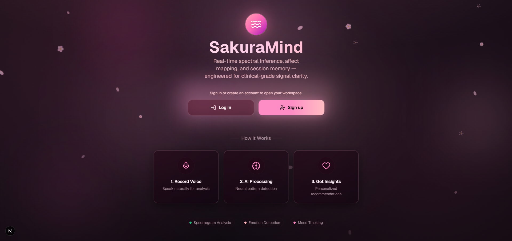
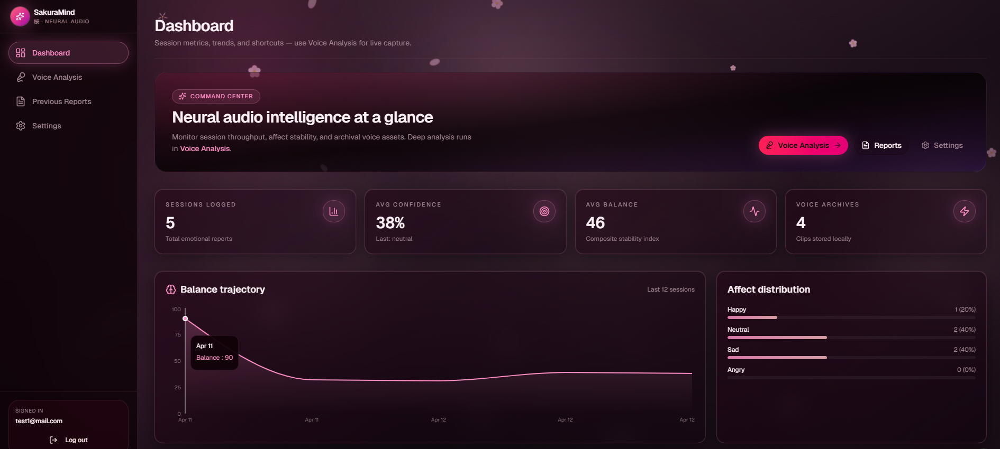
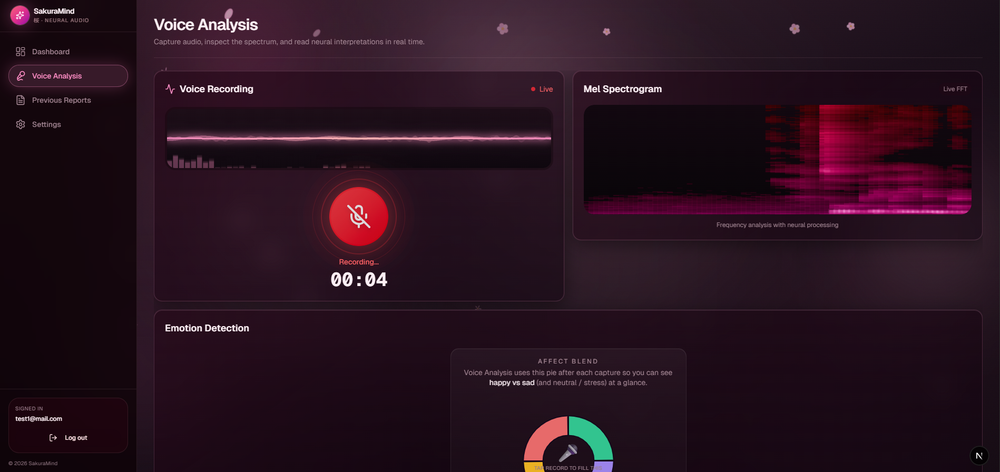
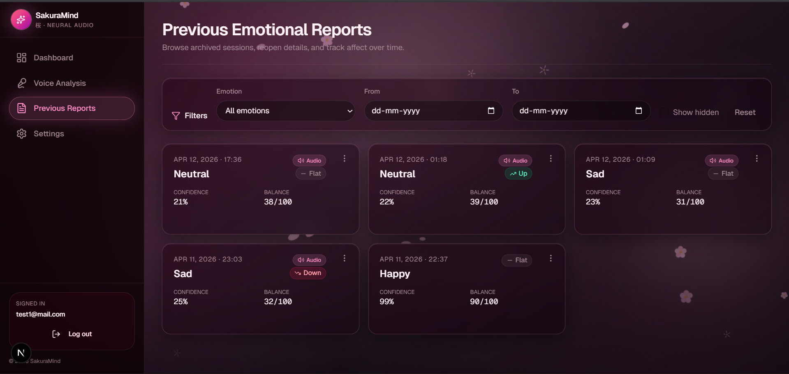
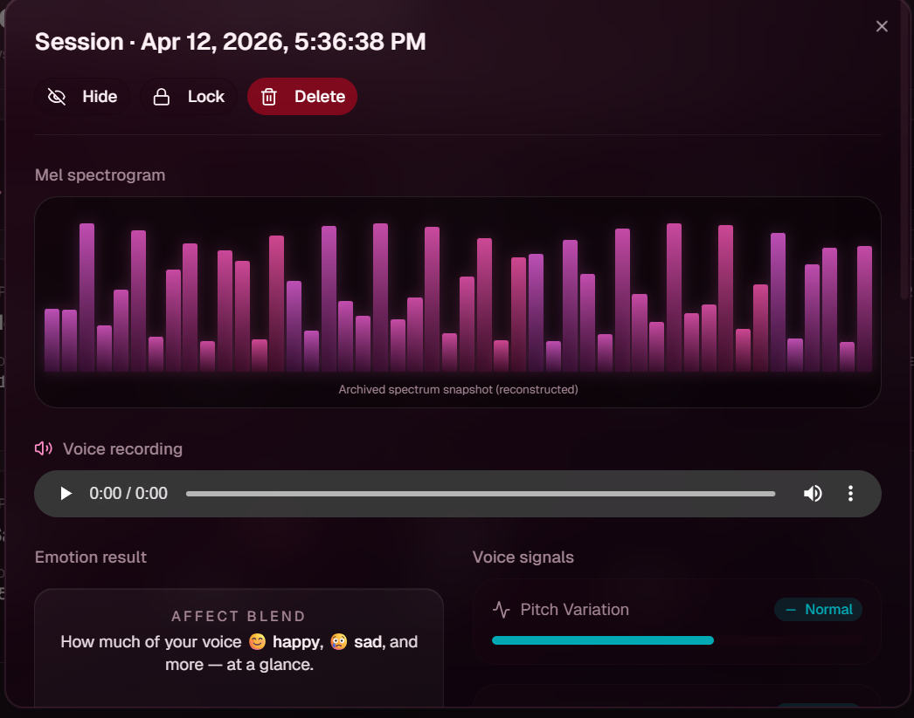
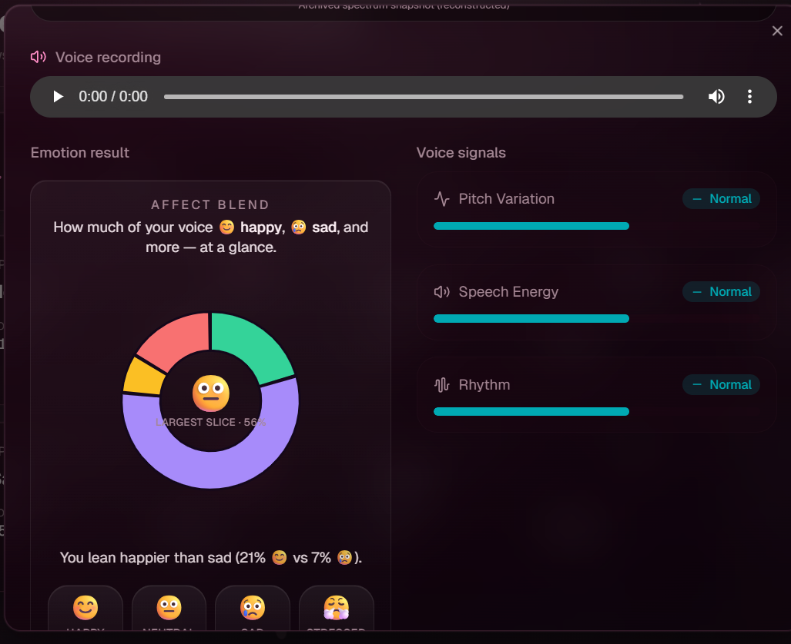
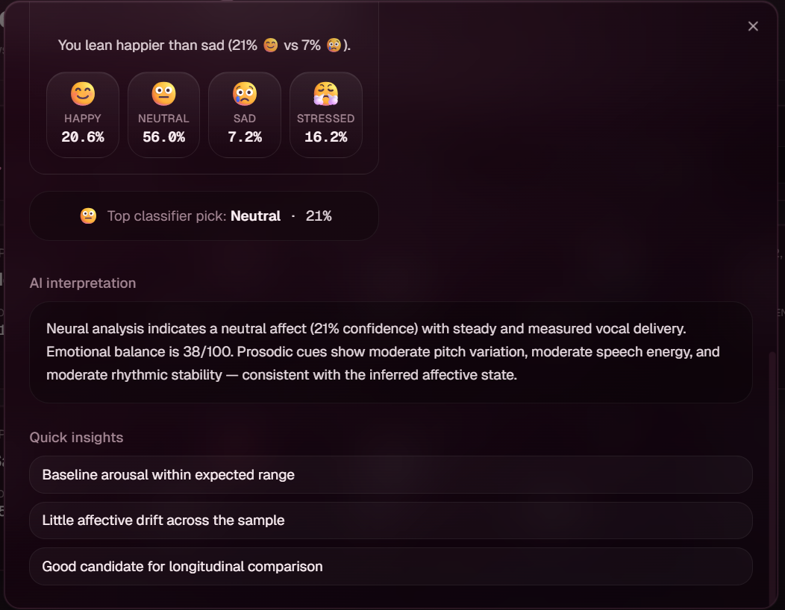

<p align="center">
  
</p>

## 🌸 AI-Powered Emotional Wellness Platform

SakuraMind is an AI-powered emotional wellness platform that transforms voice recordings into meaningful emotional insights.

By combining audio signal processing, machine learning, and behavioral analytics, SakuraMind helps users better understand emotional patterns through voice-based analysis, trend tracking, and personalized reporting.

Built at the intersection of Artificial Intelligence, Wellness Technology, and User-Centered Design.

**🔗 Live demo:** https://sakura-mind.vercel.app
**🧠 Inference API:** https://ignite2005-sakuramind.hf.space (FastAPI on Hugging Face Spaces)

## Table of Contents

1. Project Overview
2. Application Preview
3. Core Capabilities
4. Architecture
5. Repository Structure
6. Technology Stack
7. Quick Start
8. Detailed Setup
9. Deployment
10. API Reference
11. Authentication Model
12. Model Training Pipeline
13. Development Scripts
14. Known Limitations
15. Troubleshooting
16. Roadmap
17. Documentation Map

## Project Overview

SakuraMind is an AI-powered emotional wellness platform that explores how voice signals can be used to better understand emotional patterns and behavioral trends.

The system captures short voice recordings, converts them into mel spectrograms, performs machine learning inference, and generates emotional insights that can be tracked over time.

### Key Goal

The primary objective of SakuraMind is to investigate whether voice-based emotional analysis can provide an accessible and intuitive way for users to monitor emotional well-being before patterns develop into long-term burnout or emotional fatigue.

The application is **deployed as two services**: a Next.js frontend on Vercel and a containerized FastAPI + PyTorch inference backend on Hugging Face Spaces. It also runs fully locally for development.

## 📸 Application Preview

### 🌸 Landing Experience



*Clean onboarding experience introducing SakuraMind's mission and workflow.*

---

### 📊 Emotional Dashboard



*Track emotional balance, confidence scores, and historical trends through an interactive dashboard.*

---

### 🎤 Voice Analysis



*Record voice samples, generate spectrograms, and perform real-time emotion analysis.*

---

### 📁 Emotional Reports



<p align="center">
  
</p>

*Archived session overview showing spectrogram reconstruction, recorded audio playback, and voice signal metrics.*

<p align="center">
  
</p>

*Emotion distribution analysis including affect blend, emotional balance indicators, and speech characteristics.*

<p align="center">
  
</p>

*AI-generated interpretation with emotional assessment and actionable insights derived from voice analysis.*

## Core Capabilities

### 🎤 Voice Analysis
- Real-time voice recording in the browser
- Minimum-length recording validation
- Automatic audio preprocessing

### 🧠 Emotion Detection
- Mel spectrogram generation
- ResNet18-based emotion classification
- Confidence score estimation

### 📊 Emotional Insights
- Emotion trend tracking
- Historical session analysis
- Emotional balance monitoring

### 📁 Report Management
- Session report browser
- Report locking and unlocking
- Local report persistence

### ⚙️ Personalization
- Theme customization
- Brightness controls
- Remember Me session persistence

## Architecture

SakuraMind runs as two decoupled services in production, with a self-contained local mode for development.

```text
                          ┌──────────────────────────────┐
   Browser (mic) ───────► │  Next.js Frontend (Vercel)   │
                          │  /api/analyze  (proxy route) │
                          └───────────────┬──────────────┘
                                          │  multipart voiceBlob
                                          ▼
                          ┌──────────────────────────────┐
                          │  FastAPI Backend (HF Spaces) │
                          │  Docker + ffmpeg             │
                          │  1. WebM → WAV (ffmpeg)      │
                          │  2. WAV → mel spectrogram    │
                          │  3. ResNet18 inference       │
                          │  4. render web spectrogram   │
                          └───────────────┬──────────────┘
                                          │  { emotion, confidence, mel }
                                          ▼
                          ┌──────────────────────────────┐
                          │  Frontend renders result,    │
                          │  saves report to localStorage│
                          └──────────────────────────────┘
```

### Production flow (hosted)

1. User records audio in the browser.
2. Frontend posts the audio blob to the Next.js API route `/api/analyze`.
3. When `INFERENCE_API_URL` is set, the route **proxies** the blob to the FastAPI backend.
4. The backend converts WebM → WAV (ffmpeg), builds a mel spectrogram, runs ResNet18 inference, and renders the web spectrogram in memory.
5. The backend returns `{ emotion, confidence, mel }` — where `mel` is a base64 PNG data URL (no files written to disk).
6. The frontend normalizes the label, renders the emotion + spectrogram, and stores the report in browser storage.

### Local development flow

When `INFERENCE_API_URL` is **not** set, the same `/api/analyze` route falls back to spawning the Python script (`backend/inference.py`) as a subprocess via `child_process` — no separate server needed. This keeps local iteration fast.

High-level data path (hosted):

Browser → Vercel `/api/analyze` → HF Spaces FastAPI `/analyze` → ResNet18 (`Model/emotion_model.pth`)

## Repository Structure

```text
SakuraMind
│
├── frontend/                         # Next.js frontend application
│   ├── app/
│   │   └── api/analyze/route.ts      # proxy to backend (hosted) / subprocess (local)
│   ├── components/
│   ├── hooks/
│   ├── lib/
│   ├── public/
│   └── styles/
│
├── backend/                          # Python inference service
│   ├── app.py                        # FastAPI server (/health, /analyze)
│   ├── inference.py                  # model load, prediction, spectrogram rendering
│   ├── requirements.txt              # pinned Python dependencies (CPU torch)
│   ├── main.py                       # local interactive recording script
│   ├── demo_update.py
│   └── README.md
│
├── Model/                            # Machine learning pipeline
│   ├── scripts/
│   ├── emotion_model.pth             # trained weights (git-ignored; see Model/README)
│   └── README.md
│
├── Dockerfile                        # containerizes the FastAPI backend (Python + ffmpeg)
├── .dockerignore
├── assets/
│   ├── branding/
│   │   └── sakuramind_banner.png
│   └── images/
│       ├── landing_page.png
│       ├── dashboard.png
│       ├── voice_analysis.png
│       ├── reports.png
│       ├── report_detail-1.png
│       ├── report_detail-2.png
│       └── report_detail-3.png
│
├── README.md
└── .gitignore
```

## Technology Stack

### 🎨 Frontend

- Next.js 16
- React 19
- TypeScript
- Tailwind CSS 4
- Radix UI
- Recharts

### ⚙️ Inference Backend

- FastAPI (Uvicorn)
- Python 3.11
- FFmpeg audio processing
- Docker

### 🧠 Machine Learning

- PyTorch
- TIMM (ResNet18)
- Librosa
- NumPy
- Matplotlib
- Pillow

### ☁️ Hosting

- Vercel (frontend)
- Hugging Face Spaces — Docker (inference backend)

### 💾 Data Storage

- Browser localStorage
- Browser sessionStorage
- Local report history

### 🛠 Development Tools

- pnpm
- Git / Git LFS
- VS Code

## Quick Start

### Option A — Frontend against the hosted backend (simplest)

```bash
cd frontend
pnpm install
# point the app at the deployed inference API
echo "INFERENCE_API_URL=https://ignite2005-sakuramind.hf.space" > .env.local
pnpm dev
```

Frontend runs at http://localhost:3000 and uses the hosted model — no local Python needed.

### Option B — Fully local (frontend + local Python inference)

```bash
cd frontend
pnpm install
pnpm dev            # do NOT set INFERENCE_API_URL — enables local subprocess mode
```

In another shell, ensure Python deps and ffmpeg are available (see Detailed Setup).

## Detailed Setup

### Prerequisites

- Node.js 18+
- pnpm (or npm)
- Python 3.11+ (for local inference mode)
- ffmpeg in PATH (for local inference mode)

### Install Frontend Dependencies

```bash
cd frontend
pnpm install
```

### Environment variable

The frontend selects its mode from a single variable:

| `INFERENCE_API_URL` | Behaviour |
|---------------------|-----------|
| set (e.g. the HF Spaces URL) | Hosted mode — proxies audio to the FastAPI backend |
| unset | Local mode — spawns `backend/inference.py` as a subprocess |

Create `frontend/.env.local` (see `frontend/.env.example`).

### Install Backend Dependencies (local mode only)

```bash
cd ..
python -m venv venv
venv\Scripts\activate          # Windows (use source venv/bin/activate on macOS/Linux)
pip install -r backend/requirements.txt
```

Also install ffmpeg and ensure it is on PATH for reliable WebM → WAV conversion.

### Run the backend as a server locally (optional)

You can run the same FastAPI service the cloud uses:

```bash
cd backend
uvicorn app:app --host 0.0.0.0 --port 7860
# then set INFERENCE_API_URL=http://localhost:7860 in frontend/.env.local
```

## Deployment

### Frontend — Vercel

1. Import the repository into Vercel (root directory: `frontend`).
2. Add an environment variable: `INFERENCE_API_URL = https://<your-space>.hf.space`.
3. Deploy. Vercel redeploys automatically on every push to the default branch.

### Backend — Hugging Face Spaces (Docker)

The `Dockerfile` at the repository root builds the inference service (Python 3.11 + ffmpeg + PyTorch), copies `backend/` and `Model/emotion_model.pth`, and serves FastAPI on port `7860`.

1. Create a new Space with SDK = **Docker**, hardware = CPU (2 vCPU / 16 GB is sufficient).
2. Push the `Dockerfile`, `backend/`, and `Model/emotion_model.pth` to the Space repo (the 43 MB model is tracked with Git LFS).
3. The Space builds and serves at `https://<user>-<space>.hf.space`.

CORS: the backend allows the Vercel origin and `localhost:3000` by default; override with the `ALLOWED_ORIGINS` env var (comma-separated).

> Note: the model runs on CPU. A container with real CPU/RAM (e.g. HF Spaces CPU basic) is required — inference is not viable on heavily throttled free tiers (e.g. ~0.1 vCPU).

## API Reference

### Frontend — `POST /api/analyze`

Analyzes an uploaded voice blob. In hosted mode this proxies to the backend; in local mode it runs Python directly.

Request:

- Content-Type: `multipart/form-data`
- Field: `voiceBlob`

Response (success):

```json
{
  "emotion": "happy",
  "confidence": 92,
  "mel": "data:image/png;base64,iVBORw0KGgo...",
  "_t": 1711111111111
}
```

Notes:

- `confidence` is a 0–100 percentage (the backend returns 0–1; the frontend scales it).
- `mel` is a base64 PNG data URL of the spectrogram, rendered by the backend.
- Emotion classes are normalized to: happy, sad, angry, neutral (`fearful` → angry, `calm` → neutral).

### Backend — `POST /analyze` (FastAPI)

Request:

- Content-Type: `multipart/form-data`
- Field: `voiceBlob`

Response (success):

```json
{
  "emotion": "calm",
  "confidence": 0.21,
  "mel": "data:image/png;base64,iVBORw0KGgo..."
}
```

### Backend — `GET /health`

Returns service status and the model's class list:

```json
{ "status": "ok", "classes": ["angry", "calm", "fearful", "happy", "neutral", "sad"] }
```

### Frontend — `GET /api/sentiment`, `GET /api/mel` (local mode)

These endpoints read local artifacts (`history.txt`, `mel.png`) produced by the local Python path. In hosted mode the spectrogram is delivered inline via the `mel` field of `/api/analyze` instead.

## Authentication Model

Authentication is currently client-side and local-only:

- Accounts are stored in browser localStorage
- Passwords are SHA-256 hashed client-side
- Session persistence supports Remember me behavior:
  - Checked: persistent login via localStorage
  - Unchecked: session-only login via sessionStorage

Important: This is suitable for demos/prototypes, not production-grade authentication. Server-side auth (salted hashing + server sessions) is on the roadmap.

## Model Training Pipeline

Training assets and scripts are in Model/scripts.

### Dataset Preparation

1. Organize source audio into unified classes:

```bash
cd Model
python scripts/organize_dataset.py
```

2. Convert wav files to mel spectrogram PNGs:

```bash
python scripts/convert_spectrograms.py
```

### Train Model

```bash
python scripts/train.py
```

Training details in current script:

- Backbone: resnet18 (timm)
- Epochs: 15
- Batch size: 32
- Image size: 224
- Two-phase training: frozen backbone then full fine-tuning

### Inference (CLI)

```bash
python backend/inference.py temp.wav
```

Script prints JSON wrapped with sentinels for API parsing (used by local subprocess mode) and appends the latest result to history.txt.

## Development Scripts

### Frontend

```bash
cd frontend
pnpm dev
pnpm build
pnpm start
pnpm lint
```

### API Smoke Test

```bash
cd frontend
node test_api.js
```

It posts audio.wav to local /api/analyze.

## Known Limitations

- Auth is client-side only (no server-side verification)
- `next.config.mjs` allows TypeScript build errors (`ignoreBuildErrors: true`)
- Local mode writes mutable artifacts (`history.txt`, `mel.png`); hosted mode is stateless
- Report/sentiment history is stored per-browser (localStorage), not cross-device
- On idle, the Hugging Face Space sleeps; the first request after a pause incurs a cold-start delay

## Troubleshooting

### No emotion result in UI

- Confirm microphone permissions are granted
- Record at least 4 seconds
- Check the `/api/analyze` response in the browser network tab
- First request after inactivity may take ~30s while the backend wakes

### Hosted backend errors

- Check the Space is **Running** (Hugging Face Space → Logs)
- Verify `GET /health` returns the class list
- Confirm `INFERENCE_API_URL` on Vercel matches the Space URL (no trailing slash)

### ffmpeg conversion errors (local mode)

- Install ffmpeg and add it to PATH
- Retry with a clean temp.webm/temp.wav

### Python script not found (local mode)

- Verify the venv exists at project_root/venv
- Ensure dependencies are installed from `backend/requirements.txt`

## Roadmap

- [x] Add `requirements.txt` and a containerized backend
- [x] Replace per-request subprocess with a structured FastAPI service (hosted)
- [x] Deploy frontend (Vercel) and inference backend (Hugging Face Spaces)
- [ ] Replace client-only auth with server-side authentication
- [ ] Persist report/sentiment history in a database (cross-device)
- [ ] Add test coverage for API routes, auth flows, and report features
- [ ] Remove `ignoreBuildErrors` after resolving TypeScript issues

---

## Documentation Map

- Frontend documentation: [frontend/README.md](frontend/README.md)
- Backend documentation: [backend/README.md](backend/README.md)
- Model and training documentation: [Model/README.md](Model/README.md)
